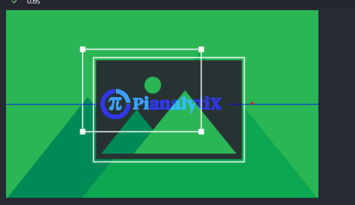
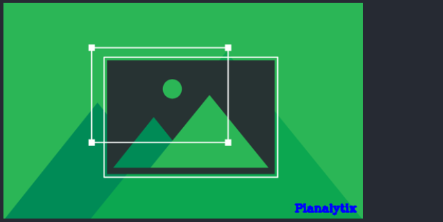

# Image Watermarking

## Steps to make this project

1. Loading the image and logo from URL'S
2. Resizing the images
3. Converting image into RGB Fromat and then converting it into numpay array.
4. Storing the height and width of the image and logo.
5. Finding out the coordinates of the center of the image or logo.
6. Finding out the region or interest to draw logo
7. Merging the logo with image and visulaziong it.
8. Creating the text watermark
9. Using CV2 funvtion to define text peoperties and applying it ar specific coordinates
10. Converting the image into RGB and visualizing it.

## Output

## NOTE: If you have Ananconda installed then you will not need requirements.txt because anaconda comes will preinstalled pachages

## NOTE: This project will take about 1 hour to run Depends on your computer
